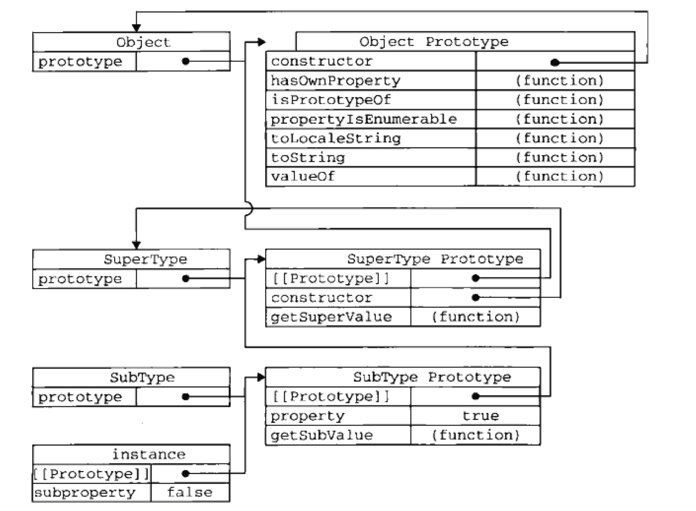
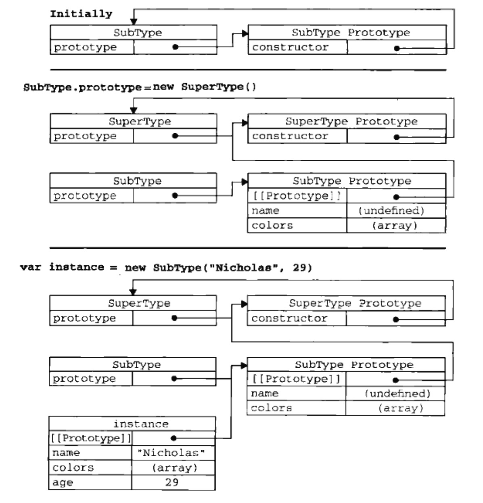

# JavaScript

<!-- TOC -->

- [JavaScript](#javascript)
    - [什么是JavaScript](#什么是javascript)
    - [面向对象](#面向对象)
        - [属性类型](#属性类型)
            - [1.数据属性](#1数据属性)
            - [2.访问器属性](#2访问器属性)
        - [定义属性](#定义属性)
        - [读取属性](#读取属性)
        - [工厂模式](#工厂模式)
        - [构造函数模式](#构造函数模式)
            - [1.构造函数的使用](#1构造函数的使用)
            - [2.构造函数的问题](#2构造函数的问题)
        - [原型模式](#原型模式)
        - [构造函数模式和原型模式](#构造函数模式和原型模式)
        - [原型链](#原型链)
        - [借用构造函数](#借用构造函数)
        - [组合继承](#组合继承)
        - [寄生组合继承](#寄生组合继承)

<!-- /TOC -->

## 什么是JavaScript

## 面向对象

### 属性类型

#### 1.数据属性

- [[Configurable]] true delete方法
- [[Enumberable]] true for-in方法
- [[Writable]] true 修改属性
- [[Value]] undefined 数据值

#### 2.访问器属性

getter/setter

- [[Configurable]] true delete方法
- [[Enumberable]] true for-in方法
- [[Get]] undefined 读取时调用
- [[Set]] undefined 写入时调用

```js

get()/set()
__defineGetter__()/__defineSetter__() 兼容老版本，呵呵哒

```

### 定义属性

定义对象属性可以使用`Object.defineProperty()`和`Object.defineProperties()`方法

推荐使用 IE9+/Firefox 4+/Safari 5+/Opear 12+/Chrome

### 读取属性

读取原型对象属性可以使用`Object.getOwnPropertyDescriptor()`和`Object.getOwnPropertyDescriptors()`

### 工厂模式

```js

function crestePerson(name, job){
    var o = new Object()
    o.name = name
    o.job = job

    o.sayName = function(){
        console.log(this.name)
    }
    return o
}

var zongzi = crestePerson('小粽子','PHP Engineer')

console.log(zongzi)

```

### 构造函数模式

```js

function Person(name, job){
    this.name = name
    this.job = job

    this.sayName = function(){
        console.log(this.name)
    }
}

var zongzi_construct = new Person('小粽子','PHP Engineer')
console.log(zongzi_construct)

// 检测
console.log(zongzi_construct instanceof Object) //true
console.log(zongzi_construct instanceof Person) //true

```

#### 1.构造函数的使用

```js
// 当构造函数
var person_compare1 = new Person('小粽子1','PHP')
person_compare1.sayName()

// 当普通函数
Person('小粽子2', 'PHP')
window.sayName()

// 另一个对象中使用
var person_compare2 = new Object()
Person.call(person_compare2, '小粽子3', 'PHP')
person_compare2.sayName()
```

#### 2.构造函数的问题

不同实例的同名函数是不等的

`console.log(person_compare1.sayName == person_compare2.sayName) //false`

### 原型模式

```js

function PersonPrototype(){

}

PersonPrototype.prototype.name = 'Shengj'
PersonPrototype.prototype.job = 'PHP Engineer'
PersonPrototype.prototype.sayName = function(){
    console.log(this.name)
}

var person1 = new PersonPrototype()
var person2 = new PersonPrototype()

# isPrototypeOf() 判断实例中[[Prototype]]是否指向原型的 PersonPrototype.prototype
# getPrototypeOf() 获取实例中[[Prototype]]的值
console.log(person1.sayName == person2.sayName) //true
console.log(PersonPrototype.prototype.isPrototypeOf(person1)) //true
console.log(Object.getPrototypeOf(person1) == PersonPrototype.prototype) //true

# 屏蔽原型属性，类似方法重载，js里是由于两层搜索，先搜索实例再搜索原型
person1.name = 'Shengj_1'
console.log(person1.name) //Shengj_1 来自实例
console.log(person2.name) //Shengj 来自原型

# hasOwnProperty() 判断实例是否有这个属性或方法
console.log(person1.hasOwnProperty('name')) //true
console.log(person2.hasOwnProperty('name')) //false

# keys()/getOwnPropertyNames()
# 都是对于Object的，获取枚举属性，getOwnPropertyNames()会把constructor也列出来
console.log(Object.keys(PersonPrototype.prototype)) //(3) ["name", "job", "sayName"]
console.log(Object.getOwnPropertyNames(PersonPrototype.prototype)) //(4) ["constructor", "name", "job", "sayName"]
console.log(Object.keys(person1)) //["name"]
console.log(Object.getOwnPropertyNames(person1)) //["name"]

# 重写原型对象
我们先实例化一个原型对象，然后重写原型对象，再去调用其原有的属性和方法，error，因为重写原型对象失去了对象实例化的关联
```

### 构造函数模式和原型模式

```js

// 组合使用构造函数模式和原型模式
function PersonTrue(name, job){
    this.name = name
    this.job = job
    this.friends = ['wangm','chensw']
}

PersonTrue.prototype = {
    constructor: PersonTrue,
    sayName: function(){
        console.log(this.name)
    }
}

var personTrue1 = new PersonTrue('小粽子_True1','PHP')
var personTrue2 = new PersonTrue('小粽子_True2','PHP')

personTrue1.friends.push('liwt')

console.log(personTrue1)
console.log(personTrue2)

console.log(personTrue1.name === personTrue2.name) //false
console.log(personTrue1.sayName === personTrue2.sayName) //true
```

### 原型链

js中没有`接口继承interface`，只有`实现继承extends`，而且是基于`原型链`的。

```js

function SuperType(){
    this.property = true
}

SuperType.prototype.getSuperValue = function(){
    return this.property
}

function SubType(){
    this.subproperty = false
}

// 继承
SubType.prototype = new SuperType()

SubType.prototype.getSubValue = function(){
    return this.subproperty
}

var instance = new SubType()
console.log(instance.getSuperValue()) //true

# instance指向SubType的原型，SubType的原型又指向SuperType的原型，SuperType的原型又指向Object的原型

console.log(instance instanceof Object) //true
console.log(instance instanceof SuperType) //true
console.log(instance instanceof SubType) //true

console.log(Object.prototype.isPrototypeOf(instance)) //true
console.log(SuperType.prototype.isPrototypeOf(instance)) //true
console.log(SubType.prototype.isPrototypeOf(instance)) //true

```

**详细见图**


### 借用构造函数

主要是用到了`call()/apply()`，`SuperType.call(this, 'Shengj')`

### 组合继承

原型链和借用构造函数组合使用

```js

function SuperTypeCombine(name){
    this.name = name
    this.colors = ['red', 'blue', 'green']
}
SuperTypeCombine.prototype.sayName = function(){
    console.log(this.name)
}
function SubTypeCombine(name, job){
    SuperTypeCombine.call(this, name)

    this.job = job
}

// 继承
SubTypeCombine.prototype = new SuperTypeCombine()
SubTypeCombine.prototype.constructor = SubTypeCombine
SubTypeCombine.prototype.sayJob = function(){
    console.log(this.job)
}

var instance_combine1 = new SubTypeCombine('小性子','JS')
instance_combine1.colors.push('black') 
console.log(instance_combine1.colors) //(4) ["red", "blue", "green", "black"]
instance_combine1.sayName() //小性子
instance_combine1.sayJob() //JS

var instance_combine2 = new SubTypeCombine('小粽子','PHP')
console.log(instance_combine2.colors) //(3) ["red", "blue", "green"]
instance_combine2.sayName() //小粽子
instance_combine2.sayJob() //PHP
```

### 寄生组合继承

目的是为了只调用一次超类的constructor

```js
// inheritProtoType(SubTypeCombine,SuperTypeCombine)用来替换掉
// SubTypeCombine.prototype = new SuperTypeCombine()
// SubTypeCombine.prototype.constructor = SubTypeCombine
// 目的是为了减少一次调用SuperTypeCombine的constructor
function inheritProtoType(SubTypeCombine, SuperTypeCombine){
    var property = object(superType.property) //创建对象
    property.constructor = SubTypeCombine //增强对象
    SubTypeCombine.property = property //指定对象
}

function SuperTypeCombine(name){
    this.name = name
    this.colors = ['red', 'blue', 'green']
}

SuperTypeCombine.prototype.sayName = function(){
    console.log(this.name)
}

function SubTypeCombine(name, job){
    SuperTypeCombine.call(this, name)

    this.job = job
}

// 继承
inheritProtoType(SubTypeCombine,SuperTypeCombine)
SubTypeCombine.prototype.sayJob = function(){
    console.log(this.job)
}

var instance_combine1 = new SubTypeCombine('小性子','JS')
instance_combine1.colors.push('black')
console.log(instance_combine1.colors) //(4) ["red", "blue", "green", "black"]
instance_combine1.sayName() //小性子
instance_combine1.sayJob() //JS

var instance_combine2 = new SubTypeCombine('小粽子','PHP')
console.log(instance_combine2.colors) //(3) ["red", "blue", "green"]
instance_combine2.sayName() //小粽子
instance_combine2.sayJob() //PHP
```

**详细见图**

