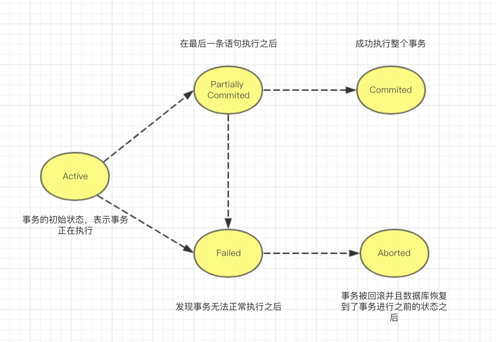

# mysql

<!-- TOC -->

- [mysql](#mysql)
    - [一、mysql是什么](#一mysql是什么)
    - [二、mysql安装](#二mysql安装)
        - [1、yum安装](#1yum安装)
        - [2、源码安装](#2源码安装)
    - [三、mysql使用](#三mysql使用)
        - [1、数据库](#1数据库)
        - [2、数据表](#2数据表)
        - [3、数据库CURD操作](#3数据库curd操作)
    - [四、mysql索引](#四mysql索引)
    - [五、mysql事务](#五mysql事务)
        - [1、原子性](#1原子性)
        - [2、一致性](#2一致性)
        - [3、隔离性](#3隔离性)
        - [4、持久性](#4持久性)
        - [总结](#总结)
    - [六、mysql优化](#六mysql优化)
        - [1、编码](#1编码)
    - [七、参考资料](#七参考资料)

<!-- /TOC -->

## 一、mysql是什么

MySQL（官方发音为/maɪ ˌɛskjuːˈɛl/“My S-Q-L”，但也经常读作/maɪ ˈsiːkwəl/“My Sequel”）原本是一个开放源代码的关系数据库管理系统，原开发者为瑞典的MySQL AB公司，该公司于2008年被昇阳微系统（Sun Microsystems）收购。2009年，甲骨文公司（Oracle）收购昇阳微系统公司，MySQL成为Oracle旗下产品。

## 二、mysql安装

### 1、yum安装

```sh

# 检测已安装的mysql
yum list installed | grep mysql

# 移除已安装的mysql
yum -y remove mysql-libs.x86_64

# 下载mysql5.7的rpm包
wget https://dev.mysql.com/get/mysql57-community-release-el6-11.noarch.rpm

# yum本地安装源
yum localinstall mysql57-community-release-el6-11.noarch.rpm

# 检测允许安装的mysql插件
yum repolist enabled | grep mysql
yum search mysql-community

# 安装mysql
yum -y install mysql-community-server.x86_64

# 启动mysql
service mysqld start

# 自启动
chkconfig mysqld on

# 初始密码
-> 2lNu<K?kk;6%
grep 'temporary password' /var/log/mysqld.log

# 进入数据库
mysql -u root -p 2lNu<K?kk;6%

# 修改密码
ALTER USER 'root'@'localhost' IDENTIFIED BY 'Root666,.';

# 远程登录密码
GRANT ALL ON *.* to root@'%' IDENTIFIED BY 'Root666,.';
GRANT ALL ON *.* to shengj@'%' IDENTIFIED BY 'Root666,.';

# 远程登录
mysql -h 104.223.3.138  -u root  -p Root666,.
```

### 2、源码安装

## 三、mysql使用

数据库：demo

数据表：user

字段：id int(11) | account varchar(255) | password varchar(255)

### 1、数据库

```sql

# 创建数据库
create database `demo`;

# 查看所有数据库
show databases;

# 查看某个数据库
show create database `demo`;

# 修改数据库编码
alter database `demo` default character set utf8 collate utf8_unicode_ci;

# 删除数据库
drop database `demo`;
```

### 2、数据表

```sql

# 选择使用哪个数据库
use `demo`;

# 创建user表
CREATE TABLE `user` (
  `id` int(11) unsigned NOT NULL AUTO_INCREMENT,
  `account` varchar(255) NOT NULL,
  `password` varchar(255) NOT NULL,
  PRIMARY KEY (`id`)
) ENGINE=InnoDB DEFAULT CHARSET=utf8;

# 查看表字段名
desc `user`;

# 修改表名
alter table `user` rename to `users`;

# 修改字段名
alter table `user` change `account` `name` varchar(255) NOT NULL;

# 修改字段数据类型
alter table `user` modify `password` varchar(500) NOT NULL;

# 添加字段
alter table `user` add `uid` varchar(50) NOT NULL after `id`;

# 删除字段
alter table `user` drop `uid`;

# 修改字段位置
alter table `user` modify `password` varchar(500) first;
注：字段类型必须带上
alter table `user` modify `password` varchar(500) NOT NULL after `account`;

# 删除数据表
drop table `user`;
```

### 3、数据库CURD操作

```sh

# 添加数据
【单条数据】insert into `user` (account,password) values ('shengj','123456');
【批量】insert into `user` (account,password) values ('shengj','123456'),('wangm','123456');

# 更新数据
【单条数据】update `user` set password='123456789' where id=1;
【批量】update `user` set password='123456789' where id>1;

# 删除数据
【单条数据】delete from `user` where id=1;
【批量】delete from `user` where id>1;

# 查询
查询全部
select * from `user`;

查询某个字段
select `account` from `user`;

where条件查询
select * from `user` where id=1;

in/not in 关键字查询
select * from `user` where id in (1,2);
select * from `user` where id not in (1,2);

between and 关键字查询
select * from `user` where id between 1 and 3;

空值(null)查询，使用is null来判断
alter table `user` add `age` varchar(10) default null;
select * from `user` where age is null;

distinct(去重)关键字查询
select distinct(account) from `user`;

like关键字查询
select * from `user` where `account` like "%en%";

and关键字多条件查询,or关键字的使用也是类似
select * from `user` where `account`='shengj' and `id`>1;
select * from `user` where `account`='shengj' or  `account`='cenh';

# 聚合函数
count()函数 -> 记录总条数
sum()函数 -> 某个字段的总和
avg()函数 -> 字段的平均数
max()函数 -> 字段的最大值
min()函数 -> 字段的最小值

排序 order by
select * from `user` order by `id` desc; // 倒序
select * from `user` order by `id` asc; // 升序 默认

分组 group by
select * from `user` group by `id`;

使用limit限制查询结果的数量
select * from `user` limit 2;

别名 as
select u.id from `user` as u; // 表别名
select account as name from `user`; // 字段别名


```

## 四、mysql索引

作用：提高表中数据的查询速度

    1.普通索引
    2.唯一性索引
    3.全文索引
    4.单列索引
    5.多列索引

```sql

CREATE TABLE `love` (
  `id` int(11) unsigned NOT NULL AUTO_INCREMENT,
  `uid` varchar(50) NOT NULL,
  `name` varchar(200) NOT NULL,
  `quote` varchar(50) NOT NULL,
  `space` varchar(50) NOT NULL,
  PRIMARY KEY (`id`),
  INDEX (`uid`), # 普通索引
  UNIQUE INDEX unique_name(`name`), # 唯一索引
  FULLTEXT INDEX fulltext_quote(`quote`), # 全文索引
  INDEX multi(id,space(20)) # 多列索引
) ENGINE=InnoDB DEFAULT CHARSET=utf8;


```

## 五、mysql事务

mysql事务可以理解为一系列操作，要么成功执行，要么失败。

四个特性ACID

- atomicity  原子性
- consistency 一致性
- isolation 隔离性
- durability 持久性

### 1、原子性

下图可以很好的描述事务的原子性：事务要不就在执行中，要不然就是成功或者失败的状态


### 2、一致性

如果一个事务原子地在一个一致地数据库中独立运行，那么在它执行之后，数据库的状态一定是一致的。对于这个概念，它的第一层意思就是对于数据完整性的约束，包括主键约束、引用约束以及一些约束检查等等，在事务的执行的前后以及过程中不会违背对数据完整性的约束，所有对数据库写入的操作都应该是合法的，并不能产生不合法的数据状态。

### 3、隔离性

如果所有的事务的执行顺序都是线性的，那么对于事务的管理容易得多，但是允许事务的并行执行却能能够提升吞吐量和资源利用率，并且可以减少每个事务的等待时间。

### 4、持久性

事务的持久性就体现在，一旦事务被提交，那么数据一定会被写入到数据库中并持久存储起来。

### 总结

事务的 ACID 四大基本特性是保证数据库能够运行的基石，但是完全保证数据库的 ACID，尤其是隔离性会对性能有比较大影响，在实际的使用中我们也会根据业务的需求对隔离性进行调整，除了隔离性，数据库的原子性和持久性相信都是比较好理解的特性，前者保证数据库的事务要么全部执行、要么全部不执行，后者保证了对数据库的写入都是持久存储的、非易失的，而一致性不仅是数据库对本身数据的完整性的要求，同时也对开发者提出了要求 - 写出逻辑正确并且合理的事务。

## 六、mysql优化

### 1、编码

```sql
# 查看mysql编码
show variables like 'character%';
+--------------------------+----------------------------+
| Variable_name            | Value                      |
+--------------------------+----------------------------+
| character_set_client     | utf8mb4                    | 客户端来源数据使用的字符集
| character_set_connection | utf8mb4                    | 连接层字符集
| character_set_database   | utf8                       | 当前选中数据库的默认字符集
| character_set_results    | utf8mb4                    | 查询结果字符集
| character_set_server     | latin1                     | 默认的内部操作字符集
| character_set_system     | utf8                       | 系统元数据(字段名等)字符集
+--------------------------+----------------------------+
8 rows in set (0.01 sec)

# 字符集
utf8、utf8mb4
要在 Mysql 中保存 4 字节长度的 UTF-8 字符，需要使用 utf8mb4 字符集，但只有 5.5.3 版本以后的才支持(查看版本： select version();)。我觉得，为了获取更好的兼容性，应该总是使用 utf8mb4 而非 utf8.  对于 CHAR 类型数据，utf8mb4 会多消耗一些空间，根据 Mysql 官方建议，使用 VARCHAR  替代 CHAR。

# 排序规则
_ci、_bin
_ci表示大小写不敏感
_bin表示按编码值比较

```

## 七、参考资料

- [mysql基本操作命令汇总](http://www.jianshu.com/p/118e1c41e9f0)
- [『浅入深出』MySQL 中事务的实现](http://draveness.me/mysql-transaction.html)